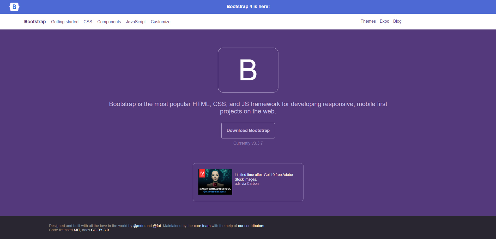

# Evaluación Práctica UF1303 del Certificado Profesional

Examen práctico sobre replicar una página de Bootstrap, dada como imagen en un documento por el profesor, con unos parametros marcados. Utilizando HTML y CSS.
En el proceso de aprendizaje haciamos varios ejercicios prácticos para aprender a fondo CSS y luego pasabamos a hacer evaluaciones prácticas y cuestionarios con preguntas. Esta es una de esas evaluaciones, pero comparto mas en mi GitHub.

## Captura de Pantalla

## Ver ejemplo en vivo
[https://github.com/iSaan86/EV_Pr-ctica_R-plica1](https://github.com/iSaan86/EV_Pr-ctica_R-plica1)

## Tecnologías Utilizadas

- HTML5
- CSS3

## Contacto

Para cualquier pregunta o comentario, no dudes en contactarme:

- Nombre: Alexandra Ferrera Arenas
- Perfil de Linkedin: https://www.linkedin.com/in/alexandra-ferrera-arenas/
- Correo Electrónico: sandraferreraarenas@gmail.com
